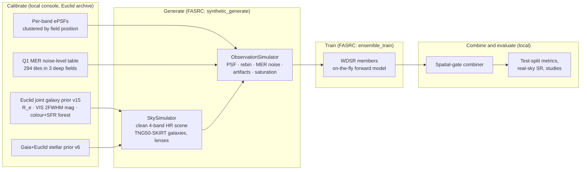

# EuclidPolish

Super-resolution of **Euclid** imaging. EuclidPolish takes the four delivered Euclid bands
(VIS + NISP Y_E / J_E / H_E, all on the MER 0.10″/pix grid) and reconstructs a deconvolved,
twice-sampled 4-band sky at 0.05″/pix. The approach follows POLISH
([Connor+ 2022](https://arxiv.org/abs/2111.03249)): train on **synthetic** Euclid scenes whose
clean high-resolution truth is known, with a forward model that reproduces what Euclid's MER
pipeline actually delivers. The backbone is WDSR ([Yu+ 2018](https://arxiv.org/abs/1808.08718)) built from WDSR-B residual blocks.
The shipped model is an **ensemble** of WDSR members fused by a learned **spatial-gate combiner**.

The science goal is to recover structure below the Euclid PSF, especially to flag strong-lens
candidates in the small-Einstein-radius population that a wide, low-resolution survey misses.

Heavy work (data generation, training) runs on Harvard's FASRC cluster through SLURM. Everything
is driven from a local web console (Flask backend + React/TypeScript SPA) that connects to FASRC
over one SSH ControlMaster.

---

## Contents

1. [How it works](#1-how-it-works)
2. [Current status](#2-current-status-2026-10-04)
3. [Getting started](#3-getting-started)
4. [Repository layout](#4-repository-layout)
5. [Photometry and units](#5-photometry-and-units)
6. [Synthetic scenes](#6-synthetic-scenes)
7. [The Euclid forward model](#7-the-euclid-forward-model)
8. [Model and training](#8-model-and-training)
9. [Combiner, evaluation and studies](#9-combiner-evaluation-and-studies)
10. [Web console and FASRC orchestration](#10-web-console-and-fasrc-orchestration)
11. [Provenance, tracking and time-travel](#11-provenance-tracking-and-time-travel)
12. [Removed and legacy features](#12-removed-and-legacy-features)
13. [References](#references)

---

## 1. How it works



- **Calibrate.** Population priors are fitted from Euclid Q1 and Gaia data, frozen into
  fingerprinted JSON artifacts and *activated*. Generation refuses to run without them.
- **Generate.** `SkySimulator` renders a clean, noise-free 4-band HR scene. `ObservationSimulator`
  turns it into the LR stack the MER pipeline would deliver. Both work in electrons.
- **Train.** Each ensemble member is a WDSR network trained on synthetic pairs. In production the
  forward model is re-run on every visit to a field (fresh stars, PSF draw, noise and artifacts).
- **Combine.** A small convolutional gate learns per-pixel, per-band convex weights over the
  members. The combined SR is what every evaluator and real-sky product uses.

**Input → output.** The network maps a 4-channel LR stack `(VIS, Y_E, J_E, H_E)` at 0.10″/pix,
in raw electrons, to a 4-channel deconvolved sky at 0.05″/pix. Inside the model, each member's
network works on an asinh stretch of those electrons at its own knee (§8.2). The target is the clean scene
blurred to a 0.066″ FWHM Gaussian (§8.2), not a delta-sharp truth.

---

## 2. Current status (2026-10-04)

These figures drift quickly; the console's **Home** and **Models › Leaderboard** pages show the
live state.

| Item | State |
|---|---|
| Production model | 18 active STARFULL members (all L2 loss, ICNR, on-the-fly trained; continued to 95–100k steps on 2026-10-02) |
| Production combiner | Spatial gate over all 18 members, linear (electron) mixing, ~48k parameters; promoted 2026-10-02 |
| Headline (100 synthetic test fields) | VIS PSNR at the 100 e⁻ knee: gate 59.22 dB vs best member 58.94 dB. Knee-integrated VIS PSNR: gate 55.82 dB vs best member 54.74 dB |
| Best single members | By knee-integrated PSNR, the multi-knee "option 2" member 196 (54.74 dB VIS, §8.2); at the 100 e⁻ knee, single-knee member 171 (58.94 dB) |
| Noise model | `euclid-q1-mer-noise-levels-dithered-bilinear-v5` |
| Galaxy population | Euclid joint prior v15 (colour+SFR forest), 151.5 galaxies/arcmin² |
| Stellar population | Gaia+Euclid prior v6, 5.08 stars/arcmin² |
| Training records | train regenerated 2026-09-20; validate/test regenerated 2026-09-25 |

Known open problems: on very bright real galaxy cores the convex gate can inherit one member's
blacked-out "holes". The synthetic test split does not detect this, so real-sky products (poster
target, Q1 tiles) are checked separately.

---

## 3. Getting started

### 3.1 Environment

EuclidPolish is **not pip-installed**. It runs in place from the repository root inside one conda
environment:

```bash
conda env create -f environment.yml      # creates EuclidPolishEnv (Python 3.12, conda-forge; lenstronomy via pip)
conda activate EuclidPolishEnv
```

Scripts in `scripts/` put the repository root on `sys.path` themselves. Two scripts,
`measure_tng_radii.py` and `validate_tng_radius_manifest.py`, need `PYTHONPATH=.` when run locally;
the FASRC sbatch template exports it.

The React console (`euclid_polish/web/frontend/`, Node 22) is built into
`euclid_polish/web/static/dist/`, which is **committed**: a machine without Node can run the console.

### 3.2 Credentials and local state

| What | Where |
|---|---|
| Euclid archive login | console: System › Connections login (session only, password not stored); scripts and CLI: `EUCLID_USER` / `EUCLID_PASSWORD`; FASRC download jobs: `~/.euclid_credentials` on FASRC (written from System › Connections) |
| IllustrisTNG API token | `TNG_API_KEY`, or `~/.tng_api_key` |
| FASRC connection settings | `~/.euclid_polish/fasrc.json` (edited in System › Connections) |
| Saved run knobs ("System › Config") | `~/.euclid_polish/job_config.json` |
| Job state, ledger, queue | `~/.euclid_polish/fasrc_jobs.db`, `fasrc_job_log.csv`, `fasrc_queue.json` |

FASRC access is public-key only. Install your key once with
`ssh-copy-id <user>@login.rc.fas.harvard.edu`. If FASRC asks for two-factor authentication, open
the master connection yourself on the console's socket, then press Connect in the console:

```bash
ssh -M -S /tmp/euclid-polish-fasrc.sock -f -N -o ControlPersist=8h <user>@login.rc.fas.harvard.edu
```

### 3.3 Data layout

Large data never lives in git:

| Path (gitignored) | Contents |
|---|---|
| `data/` | catalogs, cutouts, PSFs, population calibrations, TFRecords (`images/records_v2/`), evaluation cubes and figures (`vis/`), provenance records (`_prov/`), FASRC file cache (`_fasrc_cache/`) |
| `ckpt/` | `ensemble/member_NN/` checkpoints, `ensemble_registry.json`, and the legacy single-model `wdsr/` |
| `tracking/` | the lab notebook: campaigns and frozen model studies (mirrored to holylabs) |
| `.timetravel/` | time-travel sandboxes |

| Environment variable | Default | Effect |
|---|---|---|
| `EUCLID_POLISH_DATA_DIR` | `./data` | root of every data path in `Config` (netscratch on FASRC) |
| `EUCLID_POLISH_CKPT_DIR` | `./ckpt/wdsr` | checkpoint anchor; its **parent** holds `ensemble/` and `ensemble_registry.json` |
| `EUCLID_POLISH_TRACKING_DIR` | `./tracking` | lab-notebook root |
| `EUCLID_POLISH_TIMETRAVEL_DIR` | `./.timetravel` | time-travel sandboxes |
| `EUCLID_POLISH_DISABLE_AUTO_SSH` | unset | `1` skips the console's startup FASRC connection (tests set it) |
| `EUCLID_POLISH_EVENTS_PATH` | set by sbatch | JSONL progress-event stream of a running job |

Paths default to the current directory, so start the console and scripts from the repository root.
On FASRC, code and the conda env live on holylabs; data and checkpoints live on netscratch.

### 3.4 Common commands

```bash
# Web console (the normal way to run everything): http://127.0.0.1:8765
KMP_DUPLICATE_LIB_OK=TRUE python scripts/serve.py [--port 8765] [--debug]
EUCLID_POLISH_DISABLE_AUTO_SSH=1 python scripts/serve.py      # offline: no startup SSH connect

# Synthetic data (what the synthetic_generate FASRC step runs). Needs the activated
# population artifacts, the TNG atlas, tng_properties.csv and the radius manifest.
python scripts/run_pipeline.py --skip-train --gen-workers 8 --image-size 252 \
    --ntrain 64 --nvalid 16 --ntest 16 \
    --joint-galaxy-population-file data/population_comparison/calibrations/joint_galaxy_population_active.json \
    --star-prior-file data/population_comparison/calibrations/star_population_active.json

# Ensemble members (what the ensemble_train FASRC step runs; see §8.6)
python -u scripts/train_ensemble.py --mode add --count 2 --steps 70000 --loss l2 \
    --bootstrap 0.7 --icnr --forward-onthefly 1 --batch-size 4 \
    --star-prior-file data/population_comparison/calibrations/star_population_active.json

# Fit and compare spatial-gate variants on cached member cubes (see §9.2)
python scripts/fit_spatial_gate.py fit --out-name spatial_gate_trial
python scripts/fit_spatial_gate.py compare --gates spatial_gate_combiner spatial_gate_trial

# Provenance, lab notebook and time-travel (see §11)
python scripts/prov.py show <id>
python scripts/track.py status
python scripts/timetravel.py list
```

`python main.py` (equivalently `python -m euclid_polish.cli.main`) opens an older interactive
`questionary` menu: Euclid operations, sky generation, model training and visualization. Its
training and reconstruction entries drive the retired single-model checkpoint in `./ckpt/wdsr`,
not the production ensemble (§12).

### 3.5 Tests and CI

```bash
EUCLID_POLISH_DISABLE_AUTO_SSH=1 NUMBA_DISABLE_JIT=1 MPLBACKEND=Agg PYTEST_DISABLE_PLUGIN_AUTOLOAD=1 \
    python -m pytest -q                     # ~4,240 tests
ruff check .                                # Python 3.12 target, line length 110 (pyproject.toml)

cd euclid_polish/web/frontend
npm ci && npm run typecheck && npm run lint && npm test && npm run build
```

- `tests/conftest.py` installs a no-op SSH stub, forbids writes under the live `data/`, and
  redirects the `Config` output paths tests write (`VIS_DIR`, `VIS_PSF_DIR`, `VIS_STAR_POSITIONS`,
  `TRACKING_DIR`, `TIMETRAVEL_DIR`), the job DB, the ledger and the queue to a per-test temporary
  directory. Tests never contact FASRC.
- A few tests skip when local real data is absent (COSMOS2025 FITS, `tng_properties.csv`).
- **CI** (`.github/workflows/quality.yml`, every push and PR) runs `compileall`, `ruff check .`,
  the full suite, a set of focused `--noconftest` regressions, and a frontend job (typecheck, lint,
  vitest, build). The frontend job **fails if the committed `static/dist` differs from a fresh
  build**, so every frontend source change must be followed by `npm run build` and a commit of the
  rebuilt `static/dist`.
- CI has no `data/` and resolves the latest conda packages. Local green is not CI green: reproduce
  CI failures in a clean checkout.

---

## 4. Repository layout

| Path | Role |
|---|---|
| `euclid_polish/config.py` | `Config` and `BandConfig`: band constants, zeropoints, noise model id, saturation, PSF-warp, training and path defaults |
| `euclid_polish/photometry.py` | the one module for unit conversions (AB mag ↔ electrons, archive ADU/s → electrons via `MAGZERO`) |
| `euclid_polish/sky/generation/` | `SkySimulator` (scenes), population priors, stellar prior, lens population, source catalogs |
| `euclid_polish/sky/observation/` | `ObservationSimulator` (forward model), MER noise emulation, artifacts, saturation, field variations |
| `euclid_polish/population/` | Euclid galaxy prior fitting, magnitude/radius laws, conditional colour+SFR forest |
| `euclid_polish/tng/` | the TNG50-SKIRT morphology library: atlas, property catalog, radius manifest, renderer |
| `euclid_polish/psf/` | empirical PSFs: extraction, `FastEPSFBuilder`, `PSFSet`, cleaning, rotation pools |
| `euclid_polish/catalog/` | Euclid archive client (`EuclidCatalog`) and the star catalog type (`CatalogObject`) |
| `euclid_polish/image/` | `Image` / `ImageSet` types and the TFRecord schema (`tfio.py`) |
| `euclid_polish/model.py`, `training/` | the `Model` wrapper, WDSR network, trainer, losses, LR schedule, guards, on-the-fly forward |
| `euclid_polish/ensemble.py`, `ensemble_registry.py` | `EnsembleModel` and the member registry with tombstones |
| `euclid_polish/eval/` | ensemble inference, spatial gate, metrics, evaluation runners |
| `euclid_polish/studies/` | frozen whole-ensemble studies for the paper |
| `euclid_polish/provenance/`, `tracking/`, `observability/` | identity and lineage, lab notebook and time-travel, progress events and the resource advisor |
| `euclid_polish/noise_assessment/` | standalone, read-only archive-noise diagnostic (not used by generation) |
| `euclid_polish/visualization/` | figure helpers and calibrated colour composites |
| `euclid_polish/web/` | Flask backend, FASRC orchestration, route modules, `API.md`; `frontend/` is the React SPA |
| `euclid_polish/cli/`, `main.py` | the legacy interactive menu |
| `scripts/` | command-line drivers: generation, training, gate fitting, downloads, calibrations, diagnostics |
| `paper_figures/`, `poster/` | manuscript figure builders and the poster target |
| `docs/` | population-model notes; `docs/superpowers/` holds dated design specs and plans |
| `tests/` | the pytest suite |

---

## 5. Photometry and units

Every image is in **electrons accumulated over a band's full stack** ("stack electrons"). One
electron is one detected photoelectron, so Poisson statistics apply directly. All conversions go
through `euclid_polish/photometry.py`. Besides magnitudes and archive ADU/s, it converts MER
catalogue fluxes in µJy (`AB_ZP_UJY = 23.90`) and SKIRT surface brightness in MJy/sr to stack
electrons.

The anchor is each band's stack zeropoint:

```
sim_zeropoint_e = zeropoint_ab_e_per_s + 2.5 · log10(exposure_time_s × n_exposures)
flux_e(m)       = 10^(−0.4 · (m − sim_zeropoint_e))
```

| Band | AB zeropoint (e⁻/s) | Exposure × n | Stack zeropoint | Read noise | MER sky RMS (median, e⁻/0.10″ px) | Saturation well (stack) |
|---|---|---|---|---|---|---|
| VIS | 25.92 | 560.52 s × 4 = 2242.08 s | 34.297 | 3.6 e⁻ | 29.81 | 709,920 e⁻ |
| Y_E | 25.04 | 87.2 s × 4 | 31.396 | 6.1 e⁻ | 9.40 | 7,798 e⁻ |
| J_E | 25.26 | 87.2 s × 4 | 31.616 | 6.1 e⁻ | 9.90 | 4,571 e⁻ |
| H_E | 25.21 | 87.2 s × 4 | 31.566 | 6.1 e⁻ | 9.69 | 9,550 e⁻ |

- The VIS zeropoint is the Q1 VIS ADU zeropoint plus the gain: 24.57 + 2.5·log10(3.48 e⁻/ADU)
  ([McCracken+ 2025](https://arxiv.org/abs/2503.15303)). Synthetic flux, the real-cutout
  conversion and the saturation well therefore share one Q1 calibration.
- 560.52 s is the effective VIS integration per frame (566 s commanded). The two short 89.52 s
  exposures of the reference observing sequence are ignored.
- For NISP, 87.2 s is the MACC photon-collecting time; 112 s is the planning time including the
  reset frame ([Jahnke+ 2024](https://arxiv.org/abs/2405.13493), Table 4).
- Archive mosaics are delivered in ADU/s. They are converted to stack electrons with
  `10^((sim_zeropoint_e − MAGZERO) / 2.5)`, using each file's `MAGZERO` header keyword (≈7.6×10³
  for VIS at `MAGZERO` 24.6). Archive images without `MAGZERO` are refused
  (`photometry.header_magzero`); one ad-hoc fetch path in `web/helpers/jobs_impl.py` still falls
  back to a factor of 1.
- Read noise and dark current remain in `BandConfig` for documentation and as the unit of the
  `--noise-aug` training knob. Production noise is the measured MER level (§7.3), not a detector
  noise budget.

---

## 6. Synthetic scenes

`SkySimulator.simulate_field` (`sky/generation/sky_simulator.py`) renders a clean `(N, N, 4)`
float32 scene on the 0.05″ grid. Production fields are **510² HR → 255² LR** (25.5″ on a side; the
HR side is kept a multiple of 6 by convention). Each field draws three independent Poisson populations with
uniform positions (clustering is not modelled), each from its own seeded RNG stream.

| Population | Source of truth | Rendered as |
|---|---|---|
| Field galaxies | Activated Euclid joint galaxy prior (v15) | TNG50-SKIRT stamp, shrink-only resized, empirical colours |
| Stars | Activated Gaia+Euclid stellar prior (v6) | single-HR-pixel deltas, injected by the forward model |
| Strong lenses | `Config.LENS_*` priors + the TNG atlas | lenstronomy SIE + external shear, TNG deflector and TNG source |

Generation is **strict**: with a positive star density, a missing stellar prior is a hard error.
The `synthetic_generate` step also refuses to submit without the galaxy artifact; a direct
`run_pipeline.py` call without one falls back to the PHZ prior (§6.6).

### 6.1 Field galaxies

`JointGalaxyPopulationPrior` (`sky/generation/cosmos_tng_prior.py`) reads the activated artifact
`data/population_comparison/calibrations/joint_galaxy_population_active.json`
(kind `euclid_vis2fwhm_circularized_sersic_re_joint`, v15). For each galaxy:

1. **Size.** Draw the circularized VIS Sérsic R_e from the radius marginal of the joint law
   (0.03–10″).
2. **Brightness.** Draw the MER 2FWHM-aperture VIS magnitude given that radius (VIS 14–29; a
   bright bridge, the fitted Q1 main line, and a flat cap at the observed Q1 peak density). The
   integral sets the density, currently 151.5 galaxies/arcmin² (≈27 per field).
3. **Colours and SFR.** The conditional colour+SFR quantile forest
   (`population/conditional_color_sfr.py`) resamples a real Q1 row for that magnitude and radius,
   with measurement noise removed by deconvolution. It returns three NISP/VIS flux ratios and an
   SFR. **No redshift is drawn** for field galaxies.
4. **Morphology donor.** A TNG galaxy is chosen by SFR rank among donors that are natively large
   enough. Stamps are only ever shrunk, never enlarged.
5. **Render and normalise.** The donor is rotated and area-downsampled to R_e, its VIS flux in a
   2×FWHM-diameter aperture (measured after convolution with a Gaussian of the drawn MER photometric
   FWHM) is scaled to the target, and Y/J/H are rescaled to the drawn colours.

Galaxies centred up to 68 HR px outside the field are also proposed and kept when their light
reaches it. Every draw is recorded in `sources_<split>.csv` (`sky/generation/source_catalog.py`).

### 6.2 Stars

`EmpiricalStellarPrior` (`sky/generation/stellar_sed.py`) reads `star_population_active.json`
(v6, 5.08 stars/arcmin²). VIS magnitudes follow a count law over VIS 12–25, normalised to Gaia and
Q1 counts; VIS−Y, Y−J and J−H come from a magnitude-conditioned Gaia BP−RP latent locus. Scenes are
stored **starless**: each field's stars are recorded in the source CSV and the forward model
deposits them as HR deltas before the PSF. A clean-only train split (`--onthefly-train`) records
no stars, because on-the-fly training draws a fresh star realization on every visit.

### 6.3 Strong lenses

`_add_lens_pure` (`sky_simulator.py`) with `sky/generation/lens_population.py`:
lenstronomy `LensModel(['SIE', 'SHEAR'])`, a random TNG deflector and source, σ_v from
Faber–Jackson on the TNG stellar mass, Collett-2015-style redshift and geometry priors, and
θ_E in (0.10, 3.5)″. Lens light uses physical-redshift rendering (100 pc/pixel atlas grid,
compactness, Tolman dimming, a 28 mag/arcsec² surface-brightness cut) followed by
class-conditioned empirical colours. The density is a `/config` knob: the `Config` default is
16.5 lenses/arcmin², but recent production records used 0.02.

### 6.4 TNG morphology library (`euclid_polish/tng/`)

- `TNGAtlas` is a read-only, validated view of `data/tng_skirt/<id>/TNG<id>_O{1..5}_Euclid_{VIS,Y,J,H}.fits`
  (TNG50-SKIRT, [Baes+ 2024](https://arxiv.org/abs/2401.04224); Euclid-band images from
  [Kovačić+ 2025](https://arxiv.org/abs/2501.14408)). A galaxy counts only when its `.done` marker and all 20 frames exist.
- `TNGPropertyCatalog` reads `data/_tng_infographics/tng_properties.csv` (SFR, stellar and halo
  mass, size) from the TNG API.
- `TNGRadiusManifest` holds each view's native VIS half-light radius. It is fingerprinted against
  the FITS files, so it is host-specific; `run_pipeline.py` validates or repairs it before starting
  workers.
- `TNGRenderer` converts native MJy/sr on the 100 pc grid to electrons on the angular grid.

### 6.5 Calibrating and activating the priors

The priors are fitted locally in the console from Euclid archive data, then frozen and activated:

1. **Galaxies** (Synthetic › Galaxies): query Q1 counts and size/FWHM distributions, fit
   (scikit-learn is used here and by the PSF-extraction clustering; generation never imports it), review, activate. Activation writes
   `joint_galaxy_population_active.json` and sets the galaxy density in System › Config.
2. **Stars** (Synthetic › Stars): query Q1 and Gaia, fit, activate.
3. **TNG**: download the atlas (FASRC step), refresh properties, validate radii.

The `synthetic_generate` step refuses to submit until both artifacts are active, and stages them
as sidecar JSON files next to the job script. The job takes the galaxy and star densities from
those artifacts (currently 151.5 and 5.08 /arcmin²), overriding System › Config; only the lens
density comes from System › Config.

### 6.6 Fallback and legacy priors

- `PhzGalaxyPopulationPrior` (`phz_galaxy_prior.py`): an empirical p(z, Kron mag, size) grid,
  used by `run_pipeline.py` only when no galaxy artifact is passed. Marked `validated: false`.
- `CosmosTngPrior` (COSMOS2025 rows plus an F814W→VIS transfer): used only by the interactive CLI
  and the poster script. COSMOS2025 no longer drives production generation.

---

## 7. The Euclid forward model

`ObservationSimulator.process` (`sky/observation/observation_simulator.py`) turns a clean scene
into what the MER pipeline delivers: a `(N/2, N/2, 4)` stack on the 0.10″ grid. The HR target is
never noised, warped or masked.

### 7.1 PSFs (`euclid_polish/psf/`)

The Euclid PSF varies across the focal plane, so each band has a **`PSFSet`** of K regional kernels
rather than one average.

- **Files.** `data/euclid_psf/euclid_psf_{VIS,Y,J,H}.fits`. HDU 0 is the field-mean kernel; HDUs 1..K
  are per-cluster kernels with `RA`/`DEC`/`NSTARS`/`FWHM` cards. Kernels are on the 0.05″ grid
  (the 0.10″ archive grid oversampled 2×). The console extracts 1023² kernels (≈51″).
- **Extraction.** `scripts/extract_all_band_psfs.py` (FASRC step `extract_euclid_psf`). Stars valid
  in all four bands are clustered once by sky position (K-Means++, ~400 stars per cluster, minimum
  200), so cluster *i* is the same field region in every band. Kernels are built with
  `FastEPSFBuilder`, a gridded-spline version of photutils' `EPSFBuilder`
  ([Anderson & King 2000](https://ui.adsabs.harvard.edu/abs/2000PASP..112.1360A)) that is ≈2.3×
  faster with identical output (`Config.PSF_FAST_EPSF_BUILDER`). Saturated cores are rejected.
  Built kernels are cached, so a job that hits its time limit resumes.
- **Cleaning on load.** A cosine radial taper takes each kernel to zero between 0.82 and 0.98 of its
  half-side, then renormalises. (The old percentile floor cut is off: it erased real wings.)
- **Fallback.** A missing band falls back to a Gaussian at its nominal FWHM. This is silent unless
  `run_pipeline.py --require-empirical-psf` is passed; every generation run records `psf_kinds` in
  its records' provenance. On-the-fly training falls back the same way and records nothing.
- **Rotation pools.** `scripts/pregenerate_psf_rotations.py` (step `psf_rotation_pool`) writes
  `euclid_psf_rotpool_<BAND>.fits`: each cluster kernel plus 12 random rolls. On-the-fly training
  loads a seeded per-member subset of clusters (`--psf-subset`, default 64). With no pool on disk, training silently uses
  the full unrotated cluster sets (no roll, no bagging). Re-extracting the ePSFs deletes the pools,
  so rebuild them afterwards.

### 7.2 Per scene

1. **PSF sample.** One sample is drawn per scene and shared by all four bands (one pointing): a
   cluster weighted by its star count, no roll in record-mode generation
   (`ObservationSimulatorConfig.psf_unrotated_prob = 1.0`), and an elastic warp with
   `alpha ~ U(0, alpha_max)`, `sigma = 3` HR px, following the POLISH PSF augmentation. The warp
   changes only the forward PSF, never the target. `alpha_max` (default 20 HR px), the warp probability (default 1, so every
   exposure is warped) and `sigma` are System › Config knobs.
2. **Convolve and rebin.** Each band is FFT-convolved with its kernel; stars are stamped with the
   same kernel. Each band is then **sum-rebinned** 2× to 0.10″, conserving electrons.
3. **Noise** (§7.3), then **artifacts** (§7.4) on the 0.10″ grid.
4. **Distant-star wings.** With probability 0.2, a field-crossing diffraction wing from an
   off-field bright star is added.
5. **Saturation** (§7.5).

### 7.3 Noise: MER emulation (`sky/observation/noise.py`)

Production noise reproduces the delivered MER mosaics rather than a detector readout chain:

```
observed = s + sqrt(sky_rms_e² + max(s, 0)) · scale_map · U
```

- `sky_rms_e` is one row per scene from `sky/observation/mer_noise_levels.json`: Q1 MER RMS-map
  levels measured at 294 extragalactic positions in 25.6″ cutouts. Band medians are
  VIS 29.81, Y 9.40, J 9.90 and H 9.69 e⁻ per 0.10″ pixel.
- `U` is dithered unit noise: four exposures of white noise on the detector grid (0.10″ VIS, 0.30″
  NISP), each shifted to a sub-pixel offset, bilinearly resampled and averaged. This reproduces the
  pixel correlation of the delivered stacks: single-pixel scatter is ≈0.66× (VIS) and ≈0.22× (NISP)
  of the aperture-level RMS.
- `scale_map` combines a shared ±1% field depth with an independent per-band pointing seam
  (probability 0.10, depth step 1.10–1.45 either way).
- The identity of this model is `Config.NOISE_MODEL = "euclid-q1-mer-noise-levels-dithered-bilinear-v5"`.
  Generation records it in the provenance of every record file. On-the-fly training refuses a
  `dirty_validate` made under a different `NOISE_MODEL`; record-mode training refuses a
  `dirty_train`/`dirty_validate` pair whose noise models differ. To refresh the table, run
  `scripts/download_mer_noise_levels.py plan`, then `acquire` (resumable) and `finalize`, commit the
  JSON and bump `NOISE_MODEL`.

### 7.4 Detector artifacts (`sky/observation/artifacts.py`)

Artifacts are the sparse residuals that survive MER rejection, injected after the noise on the
0.10″ grid (gated by `ObservationSimulatorConfig.add_artifacts`, on by default):

| Artifact | Rate | Notes |
|---|---|---|
| Cosmic rays | `CR_RATE_PER_S_PER_CM2 = 5` × delivered-MER survival factor (0.002 VIS, 0.015 NISP) | tracks of `Exp(3 px)` length, `Exp(1500 e⁻)` charge; NISP charge divided by the detector/archive area ratio |
| Hot pixels | fraction 5e-6, re-randomised per frame | `Exp(10⁴ e⁻)` charge; NISP charge divided by the area ratio, as for cosmic rays |
| Faint streaks | 4 per 1000² LR pixels | sub-σ smooth ridges (0.3–0.8 σ, random sign) that mimic MER interpolation across masked trails; visible in roughly 30–50% of Q1 VIS cutouts |
| Dead pixels | fraction 3e-4 | value replaced by low-amplitude noise; written last |

### 7.5 Saturation (`sky/observation/saturation.py`)

Saturation is triggered on the pre-noise optical signal and applied to the dirty LR stack. The MER
pipeline masks saturated cores rather than recording them clipped, so affected pixels read ≈0.

- A connected above-well source is blacked out with probability `TRAIN_SATURATION_MASK_PROB`
  (0.2 by default) up to 5× the well, rising log-linearly to 0.9 at 20× the well.
- **Star-dominated** sources lose their bounding box plus 1–3 rectangles.
- **Galaxy-dominated** sources (star plane under half the light at the peak) saturate only at
  5× the well (`SATURATION_EXTENDED_WELL_FACTOR`) and lose just the pixels above it; their
  blackout probability is measured against that 5× level.
- The split needs a star plane. Record-mode generation passes none for a field that drew no stars,
  so in those fields every saturated source, galaxy nuclei included, gets the star-style blackout
  at 1× the well. On-the-fly training always passes one.

### 7.6 Records, targets and on-the-fly training

`scripts/run_pipeline.py` (FASRC step `synthetic_generate`, 16 CPU / 64 GB / 6 h) generates and
observes fields in parallel shards under `Config.RECORDS_DIR_V2` (`data/images/records_v2/`):

| File | Contents |
|---|---|
| `clean_<split>.tfrecord` | the **starless** clean scene, (510, 510, 4) at 0.05″ |
| `hr_<split>.tfrecord` | the **starfull** target: the scene plus that field's recorded stars |
| `dirty_<split>.tfrecord` | the LR observation with stars, (255, 255, 4) at 0.10″ |
| `sources_<split>.csv` | one row per galaxy, lens and star, with every draw |

Splits are `train`, `validate` and `test` (production: 6400 / 100 / 100 fields). Values are raw
float32 electrons and can be negative. Each `tf.train.Example` carries `image`, `index`, `height`,
`width`, `channels`, `pixel_scale`, `is_clean`, `band_names`, `role`, `prov_id` and `prov_stamp`
(`image/tfio.py`).

- **Reproducible and resumable.** One recorded `run_seed` drives per-shard seed sequences. A
  run killed by its time limit resumes at shard level: intact records are salvaged and only the
  shortfall is generated.
- `--onthefly-train` writes a clean-only train split. `--regenerate-splits` rebuilds only the
  named splits; `--force` (exclusive with it) rebuilds every split. With neither, complete splits
  are skipped.
- **On-the-fly training** (`training/forward_onthefly.py`, the production default) reads only
  `clean_train`. Every visit injects fresh stars at the activated stellar density, re-runs the full
  forward model on the whole field with the member's PSF pool, and cuts eight aligned 256²/128²
  crops.

---

## 8. Model and training

### 8.1 Architecture (`training/models/wdsr.py`)

- WDSR with WDSR-B residual blocks: a 3×3 entry conv, 32 residual blocks (1×1 conv with ×6 wide
  activation + ReLU → linear 1×1 at 0.8× width → 3×3, 32 filters), a 3×3 conv and a 2× pixel shuffle. Weight-norm convolutions, no batch norm,
  ≈0.6 M parameters.
- **4 bands in, 4 bands out.** Each output band also has its own 5×5 residual skip (conv + pixel
  shuffle) that reads only that band; cross-band information flows through the shared trunk.
- **ICNR** (`--icnr`) initialises the pre-shuffle convs as a checkerboard-free nearest-neighbour
  upsampler (init only). All production members use it.

### 8.2 Objective and normalisation

- **Target.** The model estimates the deconvolved 4-band sky: the clean scene (with stars, in the
  starfull regime) convolved with a Gaussian target PSF of FWHM `Config.TARGET_PSF_FWHM_ARCSEC =
  0.066″` (`training/target_blur.py`; the run-wide `--target-psf-fwhm-arcsec` is recorded per member and kept
  on continue). Supervision is
  synthetic only; no forward operator appears in the loss.
- **asinh stretch.** Inputs and targets are stretched per band as `y = asinh(x / knee)`
  ([Lupton+ 1999](https://ui.adsabs.harvard.edu/abs/1999AJ....118.1406L)); the default knee is
  `Config.STRETCH_SCALE_E = 100 e⁻`. The stretch is applied in the input pipelines
  (`Model._build_*_pipeline` in `model.py`, using `training/augmentation.py`), after cropping, the
  dihedral transform and any `--noise-aug`. `reconstruct()` returns
  `sinh(y) · knee` electrons.
- **Per-member knees.** `--asinh-knee` sets a single knee. `--asinh-knees 0.1,1,10,100,1000,10000`
  makes a **multi-knee** member: input and target are stretched at every knee and stacked (4·K
  channels).
  - *Option 1* predicts one image per knee; inference (and so the combiner) uses the head nearest
    100 e⁻.
  - *Option 2* (`--output-knee 10`) predicts one 4-band image that is re-stretched at every knee
    for the loss. Option-2 members are currently the best single members.
  - `--knee-loss balanced` takes the geometric mean of the per-channel losses.

### 8.3 Losses, schedule and guards

- **Loss** (`--loss`): `l1`, `l2`, `l3` (rooted p-norms on the asinh residual) or `mse`. The CLI
  default is `l1`; the production recipe uses `l2`. BerHu is deprecated: old members still load,
  but it cannot be selected. A non-negativity penalty exists but is disabled
  (`Config.NONNEG_SR_WEIGHT = 0.0`, no flag).
- **Optimiser.** Adam with warmup → cosine (`training/lr_schedule.py`): linear warmup over 2000
  steps to `LR_PEAK = 5e-4`, then cosine to `LR_FINAL = 2e-5`. Continuing a member recomputes the
  cosine over the new absolute total: a warm restart, so the LR jumps to that schedule's value at
  the current step (no new warmup, not back to the peak).
- **Gradient clipping** at global norm 5.0 ([Pascanu+ 2013](https://arxiv.org/abs/1211.5063)).
- **Gradient-spike guard.** After step 2000, a validation window whose peak pre-clip norm exceeds
  `max(50, 10 × the median of the last 5 window peaks)` rolls back to the latest PSNR-best
  checkpoint. Two rollbacks halve the LR; more than 8 halvings abort the run.
- **Plateau guard.** A reduce-LR-on-plateau guard with degenerate-basin rollback exists but is
  **off** by default (`Config.PLATEAU_LR_ENABLED = False`) and applies only to `l1`.

### 8.4 Data paths and augmentation

- **On-the-fly** (`--forward-onthefly 1`, production): `clean_train` only, full forward model per
  visit (§7.6), 8 × 256² HR crops per field. Refused without the activated stellar prior
  (`--star-prior-file`) or when `dirty_validate` was generated under a different `NOISE_MODEL`.
- **Record mode** (CLI default, not used in production): `dirty_train` against `hr_train`
  (starfull) or `clean_train` (starless), 96² HR crops. Refused unless `dirty_train` and
  `dirty_validate` share a noise model.
- **Always:** a random dihedral transform (8 orientations).
- **Optional:** extra LR noise (`--noise-aug`, in read-noise units) and a deterministic field
  bootstrap (`--bootstrap 0.7`).
- **Validation** always uses the full `dirty_validate` fields against `hr_validate` (starfull) or
  `clean_validate`. PSNR uses a physical peak, a mag-17 reference star:
  `PSNR_PEAK_E ≈ 8.29×10⁶ e⁻`, `PSNR_PEAK_STRETCHED = asinh(PSNR_PEAK_E / 100) ≈ 12.02`. Multi-knee members instead score each
  band × knee channel against `asinh(PSNR_PEAK_E / knee)` and save-best on the channel mean, so
  training-curve PSNRs are not comparable across members with different knees.
- **Star regime.** Starfull (stars in the target) is the only regime trained and shown in the
  console. The backend still accepts `--starless 1`.

### 8.5 Members, registry and checkpoints

The **ensemble is the model**; a single network is an ensemble of one.

- Members live in `<parent of EUCLID_POLISH_CKPT_DIR>/ensemble/member_NN/`. Each holds the PSNR-best
  checkpoint track, a `loss_best/` track, `training_log.csv`, `origin.json` (the recipe, written once at creation:
  seed, depth, knees, loss, data and forward knobs, regime, noise model and git commit) and
  `provenance.json`.
- `ensemble_registry.json` decides which members are active. Archiving a member zips it into the lab
  notebook, writes a tombstone, and deletes the member directory locally and on FASRC. A
  reappearing directory is never re-activated automatically, but Models › Members can restore a
  member from its zip. Member indices are never reused.
- Never load a checkpoint directly for products. Use the ensemble API, which reads channel counts,
  skip layout and depth from the weights and the knees from `origin.json`:

```python
from euclid_polish.eval.ensemble_infer import load_eval_ensemble, sr_from_model

model = load_eval_ensemble()          # production gate + the STARFULL members it reads (plain mean if no gate)
lr_vis, sr, members = sr_from_model(model, lr_cube_electrons)   # (H, W, 4) → (2H, 2W, 4)
```

### 8.6 How to train

The normal path is **Models › Train** in the console. It submits the `ensemble_train` FASRC step
as a SLURM array, one member per task. The production recipe is L2, bootstrap 0.7, ICNR, 32 blocks,
on-the-fly, batch 4, 256² × 8 crops, PSF bag 64, 70k steps, 16 CPUs / 32 GB / 3 h. PSF-warp,
saturation and LR knobs come from System › Config.

```bash
python -u scripts/train_ensemble.py --mode add --count 2 --steps 70000 --loss l2 \
    --bootstrap 0.7 --icnr --forward-onthefly 1 --batch-size 4 \
    --star-prior-file data/population_comparison/calibrations/star_population_active.json \
    --member-spec '[{"asinh_knees":[0.1,1,10,100,1000,10000],"output_knee":10,"knee_loss":"balanced"},{"asinh_knee":30}]'
python -u scripts/train_ensemble.py --mode continue --members member_170 --target-steps 100000 \
    --forward-onthefly 1 --star-prior-file data/population_comparison/calibrations/star_population_active.json
python -u scripts/train_ensemble.py --mode fork --fork-from member_196 --fork-track psnr --count 1 \
    --steps 70000 --loss l2 --knee-loss balanced --bootstrap 0.7 --forward-onthefly 1 \
    --star-prior-file data/population_comparison/calibrations/star_population_active.json
```

- **Continue** resumes from the PSNR-best checkpoint and keeps the architecture and knees
  (checkpoint + `origin.json`) plus the recorded star regime, loss, target blur and knee loss.
  Other knobs, including the data path and bootstrap, follow the run's flags.
- **Fork** copies the source's architecture, weights, knees and regime, and starts at step 0 with
  a fresh optimiser and schedule. Its loss, knee loss, bootstrap, data path and steps come from the
  run's flags, not from the source.
- The CLI defaults (`--loss l1`, record mode, no ICNR, no bootstrap, `--steps 100000`) differ from the production recipe; pass the
  recipe flags explicitly when training from the command line.

---

## 9. Combiner, evaluation and studies

### 9.1 The production model: members + spatial gate

The real-target evaluators (grouped runs, `scripts/eval_catalog.py`, synthetic stamps, and
Models › Images' Generate SR) load the model through `eval.ensemble_infer.load_eval_ensemble()`:

1. It takes the registry-active **starfull** members.
2. It loads the production combiner from `data/vis/ensemble/starfull/spatial_gate_combiner/`
   (`combiner.json` + `combiner.npz`).
3. It restores and runs only the members the gate reads.
4. If no gate loads, production SR is the plain member mean, logged as a warning.

The test-set **Evaluate** job instead runs every active starfull member, caches their cubes and
applies combiners from that cache. Real tiles (Sky, Figures › Plates) pick a model spec
(`production`, `mean`, `member:<name>`, `gate:<variant>`) from `web/helpers/model_catalog.py`;
there `production` has no mean fallback.

**The spatial gate** (`eval/spatial_gate.py`) is a small convolutional network. Its input is each
member's SR in per-band asinh space (with `--lr-input`, also the LR image and a mask of its zeroed
pixels; off by default and in production). Its output is per-pixel, per-band softmax weights over
the members. The SR is the members' convex weighted mean, so it never leaves the members' range.
Mixing happens in electrons (`mix_space="linear"`, the default) or asinh. Architecture: 1×1 conv →
space-to-depth → 1×1 merge conv → four residual dilated 3×3 convs (dilation 1, 2, 4, 8) → bilinear
2× upsample → concatenation with the full-resolution features → two 1×1 convs → logits (receptive field ≈62 HR px). Inference is pure NumPy; fitting (`eval/spatial_gate_fit.py`)
is a TensorFlow mirror of the same graph.

The legacy RBF combiners in `eval/combiner.py` are kept only to read old artifacts.

### 9.2 Fitting, comparing and promoting a gate

Gates are fitted as **named variants** next to production (`spatial_gate_<name>/`) on cached
**validate** member cubes (`cubes_validate/`: 15 fields held out, plus up to 40 blackout-stamped copies
of the training fields); a fit never overwrites `spatial_gate_combiner`.

```bash
python scripts/fit_spatial_gate.py fit --out-name spatial_gate_trial \
    [--members used] [--mix linear] [--steps 2000] [--blackout-fields 40]
python scripts/fit_spatial_gate.py compare --gates spatial_gate_combiner spatial_gate_trial
```

- The fit loss is the per-field, per-band asinh MSE relative to the best member (1.0 = as good as
  the best member), averaged over 11 log-spaced knees from 0.1 to 10⁴ e⁻. The checkpoint with the
  lowest held-out loss is kept and saved progressively.
- `--members used[:0.5%]` prunes to members whose peak weight in the production gate's cached held-out
  diagnostic reaches 0.5% in some band (`eval/gate_members.py`); members that joined after that fit
  are kept, and `--members 170,180` picks members explicitly.
- The same code runs from **Models › Combiner**. Promotion backs up the current gate, refuses
  incomplete or still-running fits and (unless forced) gates that read inactive members, and
  re-scores the cached test cubes.
- Do not edit `eval/spatial_gate_fit.py` while a fit is running: TensorFlow AutoGraph re-reads the
  source mid-fit.

### 9.3 Metrics

Synthetic scores use the held-out **test** split, computed on member cubes cached by **Evaluate**
(100 test fields by default).

- **Stretched PSNR** at the 100 e⁻ knee with the mag-17 peak (§8.4). The headline is VIS, averaged
  per field.
- **PSNR vs knee and integrated PSNR** (`eval/knee_psnr.py`): PSNR on a 21-knee grid from 0.1 to
  10⁴ e⁻, and its mean over log10(knee). This is the knee-independent way to compare members and
  combiners (Models › Leaderboard).
- **Power spectra** (`eval/power_spectrum.py`): transfer `T(k) = √(P_SR/P_HR)` and
  cross-correlation `r(k)`; above the LR Nyquist (5 cycles/″) the model is super-resolving.
- **Disagreement diagnostics** (`eval/ensemble_diagnostics.py`): member σ versus actual error.
  Members are highly correlated, so their spread is not a usable uncertainty estimate.
- **Combiner comparison** (`eval/spatial_gate_compare.py`): per-band PSNR, MSE per brightness bin,
  star-halo and blackout-hole MSE, knee curves and gate usage per member.

### 9.4 Real-sky and grouped evaluation

- `eval/grouped_runner.py` (Sky › Targets, or `python scripts/eval_grouped.py --n 100`) builds one
  run directory (`data/eval_results/` itself; `--out` changes it on the CLI) with groups `A`/`B`/`C` (Euclid Q1 strong-lens
  candidates), `gal` (real field galaxies, `eval/galaxy_catalog.py`) and `syn-lens`/`syn-gal`
  (source-centred stamps from the synthetic test split, which have HR truth and so also get PSNR).
  `--n` is per lens grade; `gal`, `syn-lens` and `syn-gal` each get up to 3n. The `gal` group is
  cache-only: it reads the `galaxies.csv` written by the separate query-galaxies step (needs a
  Euclid archive login) and is absent without it.
- `scripts/eval_catalog.py` runs the same per-object loop over any `id,ra,dec[,grade]` catalog.
- Each object stores `SR.fits` (4-band electrons), `original_stack.fits`, disagreement cubes, and
  the identity of the model that made it, so a new gate regenerates exactly the SRs it changes.
- `scripts/render_nexus_comparisons.py` renders Euclid LR / SR / JWST NEXUS F200W plates (NEXUS is
  an external morphological reference, not truth).

### 9.5 Studies, poster and paper figures

- A **study** (`euclid_polish/studies/`, Models › Leaderboard → Freeze study) freezes the whole
  ensemble into `tracking/studies/<timestamp-slug>/`: member recipes and scores, the production
  gate, PSNR-vs-knee curves, training curves, gate diagnostics and real-tile metrics. Attached
  fields are stored on holylabs and fetched on demand. Browse and export in **Figures › Studies**.
- `scripts/render_poster_combiner_triptych.py` runs the production gate on the poster target
  `poster/target_181255_lr.fits`.
- `paper_figures/build_figures.py` and `build_sr_result_prototype.py` build the manuscript figures.
  Some panels read browser exports from `EUCLIDPOLISH_FIGURE_EXPORTS` (the default is a hard-coded absolute Downloads path, so set it on any other machine).

---

## 10. Web console and FASRC orchestration

The console is a local, single-user Flask app that serves the React SPA and drives every cluster
job over one SSH ControlMaster. It is **offline-first**: only handlers that need the cluster are
gated on the connection; history, queue, config, the resource advisor and local data work without
it.

### 10.1 Running it

```bash
KMP_DUPLICATE_LIB_OK=TRUE python scripts/serve.py              # http://127.0.0.1:8765
python scripts/serve.py --port 9777 --debug                     # same as python -m euclid_polish.web
EUCLID_POLISH_DISABLE_AUTO_SSH=1 python scripts/serve.py        # no startup SSH connect
```

- On startup the app makes one SSH connection attempt (up to 30 s). If it fails, the console still
  comes up; press Connect later.
- The server has no auto-reloader. The SPA shows a banner when a loaded backend `.py` file changed
  and a restart is needed.
- **Security model** (loopback, no login): `--host` must be a loopback address; the `Host` header
  must be a loopback name (blocks DNS rebinding); mutations must be POST/PUT/PATCH/DELETE and are
  refused when cross-origin (`Sec-Fetch-Site: cross-site` or a mismatched `Origin`); every
  response carries `X-Frame-Options: DENY` and related headers; FASRC submits require
  `confirm=yes`. Every `/api/*` error is JSON `{ok: false, error, code?}`.
- `euclid_polish/web/API.md` is the endpoint reference; `tests/test_api_docs.py` keeps it in sync
  with the URL map.

### 10.2 Workspaces

`euclid_polish/web/spa_routes.json` is the single source of truth for page URLs (Flask and the SPA
both read it; `spa_redirect_cases.json` pins identical legacy redirects on both sides).

| Workspace | URL | Tabs |
|---|---|---|
| Home | `/` | production verdict, the research loop, running jobs, latest results |
| Synthetic | `/synthetic/<tab>` | status, records, galaxies, stars, noise, psf, fields |
| Models | `/models/<tab>` | leaderboard, members, train, combiner, diagnostics, images |
| Sky | `/sky/<tab>` | atlas (Aladin Lite), targets, compare |
| Figures | `/figures/<tab>` | plates, sheet, studies |
| Files | `/files` | FITS browser and inspector |
| Runs | `/runs/<tab>` | live, history, resources, steps |
| Notebook | `/notebook/<tab>` | log, backups, sandboxes |
| System | `/system/<tab>` | connections, config, lineage, code, storage, appearance |

Old URLs (`/app/...`, `/fasrc`, `/config`, `/tracking`, `/ensemble/...`) answer 308 to their new
home. Two console rules: **opening a page never starts a job**, and **nothing is pinned over the
images**.

### 10.3 Pipeline steps

Every cluster job is a `FASRCPipelineStep` (`web/fasrc_pipeline.py`), listed by
`GET /api/fasrc/steps/status` and submitted with `POST /api/fasrc/steps/<step_id>/submit`.

| Step | Script | Purpose |
|---|---|---|
| `euclid_query`, `euclid_verify_photometry` | `query_brightest_stars.py`, `verify_star_photometry.py` | bright-star catalog for PSFs |
| `download_euclid_cutouts` | `download_all_bands.py` | 4-band star cutouts |
| `extract_euclid_psf`, `psf_rotation_pool` | `extract_all_band_psfs.py`, `pregenerate_psf_rotations.py` | ePSFs and rotation pools |
| `vis_noise_sample`, `archive_field_sample` | `fasrc_download_euclid_sky_cutouts.py` | real archive fields (noise and field sampling) |
| `download_tng_skirt`, `measure_tng_radii`, `tng_grid`, `tng_stack` | `fasrc_download_tng_skirt_atlas.py`, `measure_tng_radii.py`, `fasrc_tng_infographic.py` | TNG atlas and diagnostics |
| `synthetic_generate` | `run_pipeline.py --skip-train` | TFRecords (§7.6) |
| `ensemble_train` | `train_ensemble.py` | ensemble members (SLURM array) |
| `poster_cutout` | `fasrc_poster_cutout.py` | poster cutout |

- FASRC runs scripts from its own checkout on holylabs, so push and `git pull` there before
  submitting (System › Code has FASRC git status, pull and environment update).
- Each sbatch script activates the conda env, exports `EUCLID_POLISH_DATA_DIR`,
  `EUCLID_POLISH_CKPT_DIR` and `EUCLID_POLISH_EVENTS_PATH`, and records its exit code. Logs land in
  `<repo>/logs/pipeline/` (`logs/jobs/` for `synthetic_generate`).

### 10.4 Queue, ledger and resources

- **One cluster job at a time.** A submit made while a job is pending or running is queued locally.
  A ticker promotes the next item only after the active job completes successfully; any failure
  halts the queue until it is resumed.
- Every submission is recorded in the job DB, the CSV ledger and the active tracking campaign.
  Finished jobs get `sacct` and FASRC `jobstats` accounting.
- **Runs › Resources** summarises past usage per step and recommends CPUs, GPUs, memory and time
  for a new run (memory and time: p90 + 20% over the most similar past runs; out-of-memory and
  timed-out runs set lower bounds).

### 10.5 Frontend development

Run from `euclid_polish/web/frontend` (Node 22):

```bash
npm ci
npm run dev          # Vite on http://localhost:5173, proxies API calls to FLASK_ORIGIN
npm run typecheck && npm run lint && npm test
npm run build        # writes ../static/dist — commit the result
```

The dev server proxies to `FLASK_ORIGIN`, default `http://localhost:9777`, so start Flask with
`--port 9777` (or set `FLASK_ORIGIN=http://localhost:8765`). Data reads use `useResource` (TanStack
Query); writes and jobs use `apiPost` / `useJob`. The image viewer (`src/viewer/`) renders raw
Float32 cubes on canvas; see `src/viewer/README.md`. The frontend contract is
`src/FOUNDATION.md`; theme tokens are in `src/theme/tokens.css` (light default, dark, and system).

---

## 11. Provenance, tracking and time-travel

**Provenance** (`euclid_polish/provenance/`, `scripts/prov.py`). Every process and saved artifact
gets an 8-hex `ProvId` (`00000000` means unknown or legacy) and a JSON sidecar. Generation,
training and inference runs are written to `data/_prov/`; TFRecord and SR artifacts carry sidecars
next to the data; FITS files carry `PROVID`/`PRODBY` cards; member directories carry
`provenance.json` (the model id and the training run that produced it), while the seed and git
commit are in `origin.json` and the training run's record. Minting is best-effort and never blocks work.
`prov.py show|ancestors|descendants|stale|rebuild` walks the lineage; **System › Lineage** shows
the same graph with staleness verdicts.

**Lab notebook** (`euclid_polish/tracking/`, `scripts/track.py`, **Notebook**). A campaign holds a
markdown log, the FASRC jobs submitted during it, and backups of models, FITS and images, each
stamped with the git commit. `track.py sync` mirrors the store to holylabs.

**Time-travel** (`scripts/timetravel.py`, Notebook › Sandboxes). It creates a `git worktree` at a
backup's commit, symlinks the read-only inputs, gives it fresh output directories, and launches that
old code as a second console (from port 8766), optionally with a matching FASRC sandbox.
Uncommitted changes are not captured.

**Observability** (`euclid_polish/observability/`). Jobs emit JSONL progress events and resource
samples to `$EUCLID_POLISH_EVENTS_PATH`; the console folds them into live progress.

---

## 12. Removed and legacy features

Older notes, specs and commit messages refer to things that are gone. The main ones:

| Feature | Removed | Replaced by |
|---|---|---|
| Denoiser + A_θ transition CNN ("two-stage chain") | 2026-05-27 | — |
| HST, star-anchor and round-trip supervision lanes (`train_step_sky`, `/hst-*` pages) | 2026-09-20 | synthetic supervision only; step API is `/api/fasrc/steps/*` |
| `euclid_polish/euclid/` package, `StarCatalog`, `auth.py` | 2026-06-26 | `euclid_polish/catalog/` (`EuclidCatalog`, `CatalogObject`) |
| `sky/multiband_generator.py`, `sky/multiband_forward.py`, `MultiBandForwardConfig` | 2026-06-26 | `SkySimulator`, `ObservationSimulator`, `ObservationSimulatorConfig` |
| `training/data_multiband.py` | 2026-06-28 | `Model` input pipelines + `training/augmentation.py` |
| Single-model architecture (`ckpt/wdsr` as the product) | 2026-07-01 | ensemble-only model and registry |
| Poisson + read-noise detector model in production | 2026-09-12 | MER noise emulation (§7.3) |
| Redshift-driven galaxy colours | 2026-09-13 | colour+SFR quantile forest (v15) |
| Zoobot morphology and the CNN lens-finder | 2026-08-14 | — (grouped lens evaluation remains) |
| RBF / cross-regime combiners as production | 2026-09-21 | spatial gate |
| Classic Jinja console (templates + classic JS) | 2026-09-26 | React console (at `/` since 2026-07-19, when the `/app` prefix was dropped) |
| Starless regime in the Models workspace | 2026-10-02 | starfull only (backend `--starless 1` remains) |

Still in the repository but **not** the production path (kept for old artifacts or pending
removal):

- Single-model entry points that default to the retired `./ckpt/wdsr`: the interactive CLI's
  training and reconstruction menus, `run_pipeline.py`'s training step, `scripts/fasrc_train.sh`,
  `scripts/fasrc_train_only.sh`, `scripts/infer_euclid_cutout.py`, and the field mode of
  `scripts/fasrc_poster_cutout.py`. They ignore member knees; use `load_eval_ensemble()` instead.
- `training/forward_op.py` (`EuclidVISForwardOp`), used only by tests.
- `apply_band_noise` (the old detector noise model), the COSMOS fallback flags of
  `run_pipeline.py`, and the analytic Sérsic renderer.

---

## References

- **POLISH:** Connor, Bouman, Ravi & Hallinan, [*Deep radio-interferometric imaging with POLISH: DSA-2000 and weak lensing*](https://arxiv.org/abs/2111.03249), MNRAS 514, 2614, 2022.
- **WDSR:** Yu et al., [*Wide Activation for Efficient and Accurate Image Super-Resolution*](https://arxiv.org/abs/1808.08718), 2018.
- **Euclid mission:** Euclid Collaboration: Mellier et al., [*Euclid I. Overview of the Euclid mission*](https://arxiv.org/abs/2405.13491), 2024.
- **Euclid VIS instrument:** Euclid Collaboration: Cropper et al., [*Euclid II. The VIS instrument*](https://arxiv.org/abs/2405.13492), 2024.
- **Euclid NISP instrument:** Euclid Collaboration: Jahnke et al., [*Euclid III. The NISP instrument*](https://arxiv.org/abs/2405.13493), 2024 — NISP integration times and read noise.
- **Euclid Q1 VIS processing:** Euclid Collaboration: McCracken et al., [arXiv:2503.15303](https://arxiv.org/abs/2503.15303), 2025 — VIS zeropoint and gain.
- **Euclid Q1 MER pipeline:** Euclid Collaboration: Romelli et al., [*Euclid Quick Data Release (Q1): the Euclid MERge Processing Function*](https://arxiv.org/abs/2503.15305), 2025.
- **Euclid Wide Survey:** Euclid Collaboration: Scaramella et al., [*Euclid preparation. I. The Euclid Wide Survey*](https://arxiv.org/abs/2108.01201), 2022.
- **TNG50-SKIRT Atlas:** Baes et al., [*The TNG50-SKIRT Atlas*](https://arxiv.org/abs/2401.04224), A&A 2024.
- **Euclid-band TNG50-SKIRT images:** Euclid Collaboration: Kovačić et al., [arXiv:2501.14408](https://arxiv.org/abs/2501.14408), 2025.
- **COSMOS-Web / COSMOS2025:** Shuntov et al., [arXiv:2506.03243](https://arxiv.org/abs/2506.03243), 2025 (legacy prior only).
- **Strong-lens population:** Collett, [*The population of galaxy-galaxy strong lenses in forthcoming optical imaging surveys*](https://arxiv.org/abs/1507.02657), ApJ 2015. Ray-tracing via [lenstronomy](https://github.com/lenstronomy/lenstronomy).
- **Quantile regression forests:** Meinshausen, [*Quantile Regression Forests*](https://jmlr.org/papers/v7/meinshausen06a.html), JMLR 2006.
- **ePSF construction:** Anderson & King, [*Toward High-Precision Astrometry with WFPC2. I.*](https://ui.adsabs.harvard.edu/abs/2000PASP..112.1360A), PASP 2000; implemented on `photutils.psf.EPSFBuilder`.
- **asinh stretch:** Lupton, Gunn & Szalay, [*A Modified Magnitude System*](https://ui.adsabs.harvard.edu/abs/1999AJ....118.1406L), 1999; Lupton et al., [*Preparing red-green-blue images from CCD data*](https://ui.adsabs.harvard.edu/abs/2004PASP..116..133L), 2004.
- **Gradient clipping:** Pascanu, Mikolov & Bengio, [*On the difficulty of training recurrent neural networks*](https://arxiv.org/abs/1211.5063), 2013.
- **AB magnitude system:** Oke & Gunn, [*Secondary standard stars for absolute spectrophotometry*](https://ui.adsabs.harvard.edu/abs/1983ApJ...266..713O), ApJ 1983.
